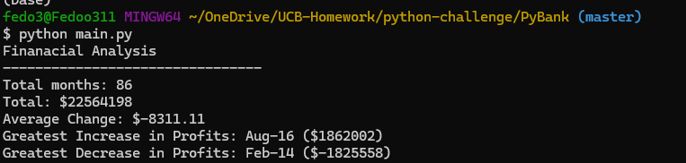
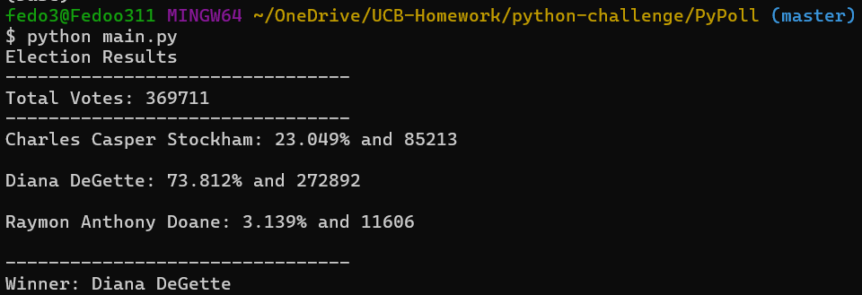

# Python-Challenge

## Table of contents

* [Description](#Description)
* [Pictures](#Picture)
* [Text](#Text)
* [Questions](#Questions)
* [References](#References)

## Description

### Financial Analysis

This is a python script to analyze the financial records of our company from a data set composed of 2 columns: "Date" and "Profit/Losses". The requirements are: The total number of months included in the dataset, the net total amount of "profit/Losses" over the entire period, the changes in "Profit/Losses" over the entire period, and then the average of those changes, the greatest increase in profits (date and amount) over the entire period and the greatest decrease in profits (date and amount) over the entire period.

### Election Analysis

In this python script I was tasked to help a small, rural town modernize its vote-counting process. The dataset is composed of three columns: "Voter ID", "County", and "Candidate". The requirements are to analyze the votes and calculate the following results: The total number of votes cast, a complete list of candidates who received votes, the percentage of votes each candidate won, the total number of votes each candidate won, and the winner of the election based on popular vote.

 ## Picture
### Financial Analysis
 

### Election Results
 

## Text

### Financial Analysis
 [View the text file](./PyBank/analysis/financial_analysis.txt)
 
### Election Results
 [View the text file](./PyPoll/analysis/election_results.txt)

## Questions
In case of any additional questions please visit my GitHub link: [Feda2020](https://github.com/Feda2020) 
Or don't hesitate to contact me via email: fido311@gmail.com

## References
 * Stach Overflow (https://stackoverflow.com/)
 * Python Module Index (https://docs.python.org/3/py-modindex.html)
 * Xpert Learning (https://bootcampspot.com)
    
    